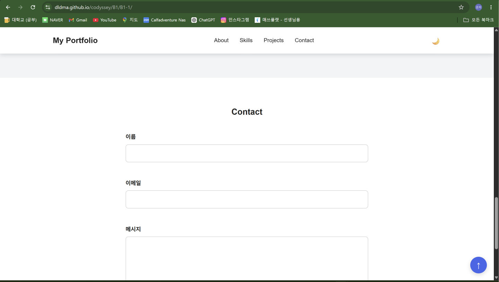
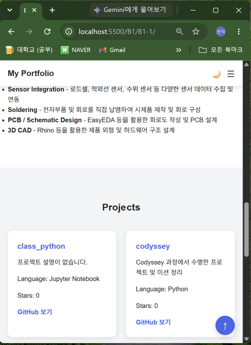
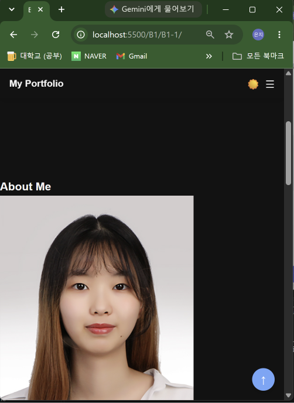

# B1-1 Responsive Portfolio

HTML, CSS, JavaScript를 사용하여 제작한 반응형 개인 Portfolio 웹사이트입니다.

정보전기전자공학 전공자로서 학습하고 있는 기술과 GitHub Repository를 소개하며,
다크 모드, 반응형 Navigation, Form Validation, GitHub API 연동 등
JavaScript를 활용한 다양한 사용자 인터랙션을 구현했습니다.


## 프로젝트 목표

이번 프로젝트에서는 별도의 JavaScript Framework를 사용하지 않고
순수 HTML, CSS, JavaScript만을 사용하여 반응형 웹페이지를 구현하는 것을 목표로 했습니다.

특히 다음 내용을 직접 구현하며 학습했습니다.

- Semantic HTML 구조 작성
- Flexbox와 Grid를 활용한 Layout 구성
- Mobile First Responsive Design
- JavaScript DOM 조작
- Event 처리
- LocalStorage 활용
- IntersectionObserver 활용
- Form Validation
- Fetch API와 async/await
- GitHub REST API 연동


## 사용 기술

### Frontend

- HTML5
- CSS3
- JavaScript ES6+

### API

- GitHub REST API

### Development Tools

- Visual Studio Code
- Live Server
- Git
- GitHub


## 주요 기능

### 1. Responsive Navigation

화면 크기에 따라 Navigation 형태가 변경되도록 구현했습니다.

- Mobile 환경에서는 Hamburger Menu 표시
- 768px 이상에서는 일반 Navigation Menu 표시
- 1024px 이상에서는 Desktop Layout에 맞게 간격 조정


### 2. Smooth Scroll

Navigation Menu와 Hero Button을 클릭하면
해당 Section으로 부드럽게 이동하도록 구현했습니다.


### 3. Dark Mode

Dark Mode Button을 통해 Light / Dark Theme를 변경할 수 있습니다.

선택한 Theme 정보는 `localStorage`에 저장하여
페이지를 새로고침해도 이전 Theme가 유지되도록 구현했습니다.


### 4. Scroll To Top

사용자가 일정 거리 이상 Scroll하면
화면 오른쪽 아래에 Scroll To Top Button이 나타납니다.

Button을 클릭하면 페이지 최상단으로 부드럽게 이동합니다.


### 5. Scroll Animation

`IntersectionObserver`를 사용하여
각 Section이 화면에 일정 부분 들어오면 나타나는 Animation을 구현했습니다.

Observer의 threshold는 다음과 같이 설정했습니다.

```javascript
threshold: 0.2
```


### 6. Contact Form Validation

Contact Form에는 다음 입력 항목이 있습니다.

- 이름
- 이메일
- 메시지

JavaScript를 이용하여 다음 내용을 검증합니다.

- 빈 입력값 확인
- 이메일 형식 확인
- 입력 오류 메시지 표시
- 정상 입력 시 성공 메시지 표시


### 7. GitHub API 연동

GitHub REST API를 사용하여
GitHub에 공개되어 있는 Repository 목록을 자동으로 불러옵니다.

사용한 API Endpoint는 다음과 같습니다.

```text
https://api.github.com/users/dldma/repos
```

Repository 데이터에서 다음 정보를 가져와 Project Card로 출력합니다.

- Repository 이름
- Repository 설명
- 사용 언어
- Star 개수
- Repository URL


### 8. API 상태 처리

API 요청 상태에 따라 서로 다른 화면을 표시하도록 구현했습니다.

- Loading
- Success
- Error
- Empty

API 요청에 실패한 경우
사용자가 다시 요청할 수 있도록 `다시 시도` Button을 제공합니다.


## 프로젝트 구조

```text
B1-1/
├── index.html
├── css/
│   └── style.css
├── js/
│   └── script.js
├── images/
│   └── profile.jpg
├── mission.md
├── process.md
└── README.md
```


## 구현 과정

프로젝트의 단계별 구현 과정은 `process.md`에 정리했습니다.

HTML 구조 작성부터 CSS Styling,
JavaScript Interaction 및 GitHub API 연동까지
개발 과정을 순서대로 기록했습니다.


## 실행 방법

Repository를 Clone합니다.

```bash
git clone https://github.com/dldma/codyssey.git
```

B1-1 Directory로 이동합니다.

```bash
cd codyssey/B1/B1-1
```

VS Code에서 `index.html` 파일을 연 후
Live Server를 실행하면 Portfolio를 확인할 수 있습니다.


## 배포

GitHub Pages를 이용하여 배포했습니다.

배포 URL:

https://dldma.github.io/codyssey/B1/B1-1/


## Screenshots

### Desktop



### Mobile



### Dark Mode




## 개발 과정에서 학습한 내용

이번 프로젝트를 통해 HTML, CSS, JavaScript가 서로 어떤 방식으로 연결되는지 확인할 수 있었습니다.

특히 JavaScript를 사용하여 DOM 요소를 선택하고,
Event에 따라 Class나 화면 내용을 변경하는 과정을 직접 구현했습니다.

또한 GitHub API를 사용하면서
`fetch`, `async/await`, `try/catch`를 이용한 비동기 데이터 처리 방법과
외부 데이터를 웹페이지에 표시하는 과정을 학습했습니다.


## Author

이은지

GitHub: [dldma](https://github.com/dldma)