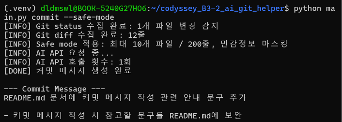
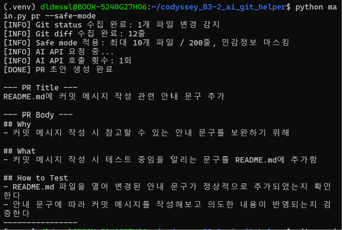
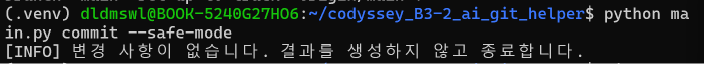
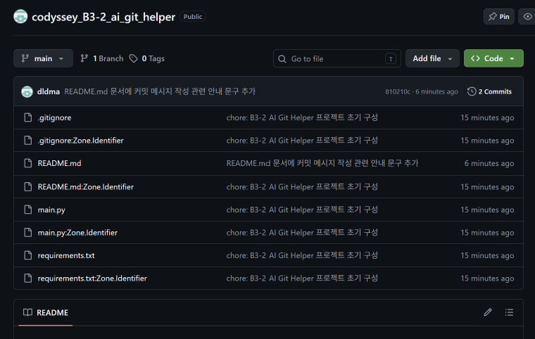
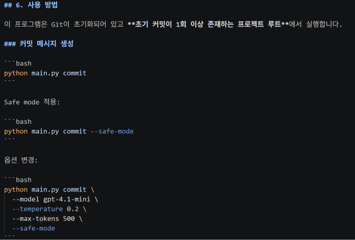
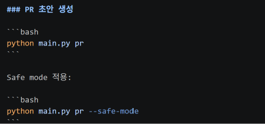

# B3-2 내가 고친 코드 설명을 AI가 대신 써주는 도우미 만들기

## 1. 프로젝트 개요

Git 변경사항을 자동으로 수집하고 AI API에 전달하여 커밋 메시지와 Pull Request 초안을 생성하는 Python CLI 도구를 구현했습니다.

프로그램은 `git status`, `git diff` 결과를 읽어 변경된 내용을 분석하고 다음 결과를 자동으로 생성합니다.

- 커밋 메시지
- PR 제목
- PR 본문
- 변경사항 요약
- 테스트 방법

또한 민감정보가 AI API에 전달되는 것을 줄이기 위해 `--safe-mode` 옵션을 구현했습니다.

---

## 2. 구현 결과

### Git 변경사항 수집

- [x] `git status` 결과 수집
- [x] `git diff` 결과 수집
- [x] 변경된 파일 목록 확인
- [x] 변경사항이 없는 경우 프로그램 종료

### AI API 연동

- [x] API Key를 환경변수로 관리
- [x] AI API 호출
- [x] 인증 실패 및 API 오류 처리
- [x] 모델 변경 옵션 구현
- [x] temperature 변경 옵션 구현
- [x] max tokens 변경 옵션 구현

### 커밋 메시지 생성

- [x] `commit` 명령 구현
- [x] 커밋 제목 자동 생성
- [x] 변경사항 불릿 요약
- [x] 제목 길이 검증 및 후처리

### Pull Request 생성

- [x] `pr` 명령 구현
- [x] PR 제목 자동 생성
- [x] `Why` 섹션 생성
- [x] `What` 섹션 생성
- [x] `How to Test` 섹션 생성
- [x] 각 섹션 최소 1개 이상의 불릿 포함

### Safe Mode

- [x] API Key 형태 문자열 마스킹
- [x] Token / Secret / Password 값 마스킹
- [x] 이메일 주소 마스킹
- [x] 최대 10개 파일 전송
- [x] 최대 200줄 전송

### API 호출 제한

- [x] `commit` 실행 시 API 1회 호출
- [x] `pr` 실행 시 API 1회 호출

---

## 3. 실행 명령어

### Commit 메시지 생성

```bash
python main.py commit --safe-mode
```

### Pull Request 초안 생성

```bash
python main.py pr --safe-mode
```

### 모델 및 파라미터 변경

```bash
python main.py commit \
  --model gpt-4.1-mini \
  --temperature 0.2 \
  --max-tokens 500 \
  --safe-mode
```

---

## 4. 실행 결과

### 4-1. Commit 메시지 자동 생성

`python main.py commit --safe-mode` 실행 결과입니다.



Git 변경사항을 수집한 뒤 AI API를 호출하여 커밋 제목과 변경사항 요약이 정상적으로 생성되었습니다.

---

### 4-2. Pull Request 초안 자동 생성

`python main.py pr --safe-mode` 실행 결과입니다.



PR 제목과 함께 다음 구조가 정상적으로 생성되었습니다.

- Why
- What
- How to Test

---

### 4-3. 변경사항이 없는 경우

변경사항이 없는 상태에서 프로그램을 실행한 결과입니다.



```text
[INFO] 변경 사항이 없습니다. 결과를 생성하지 않고 종료합니다.
```

변경사항이 없을 경우 AI API를 호출하지 않고 정상 종료되는 것을 확인했습니다.

---

## 5. GitHub Repository

프로젝트 파일을 별도 GitHub Repository에 Push했습니다.



Repository에서 다음 파일이 정상적으로 업로드된 것을 확인했습니다.

```text
main.py
README.md
requirements.txt
.gitignore
```

프로젝트 Repository:

```text
https://github.com/dldma/codyssey_B3-2_ai_git_helper
```

---

## 6. README 실행 가이드

프로젝트 README에는 다음 내용을 작성했습니다.

- 설치 방법
- 가상환경 생성 및 실행 방법
- OpenAI API Key 환경변수 설정 방법
- Commit 생성 방법
- PR 생성 방법
- CLI 옵션
- Safe Mode 정책
- API 요청 횟수 및 비용 관련 주의사항

### 실행 방법 1



### 실행 방법 2



---

## 7. 테스트 결과

다음 항목을 직접 실행하여 정상 동작을 확인했습니다.

- [x] Git 변경사항 감지
- [x] Git diff 수집
- [x] 커밋 메시지 자동 생성
- [x] PR 제목 및 본문 자동 생성
- [x] Safe Mode 동작
- [x] API Key 환경변수 사용
- [x] 잘못된 API Key 오류 처리
- [x] 변경사항이 없는 경우 종료
- [x] GitHub Repository Push

최종 Git 상태:

```text
On branch main
Your branch is up to date with 'origin/main'.

nothing to commit, working tree clean
```

---

## 8. 학습 내용

이번 미션을 통해 다음 내용을 학습했습니다.

- Python에서 Git 명령어 실행 결과를 가져오는 방법
- `git status`, `git diff`를 프로그램 입력으로 사용하는 방법
- 환경변수로 API Key를 관리하는 방법
- AI API 요청과 응답 처리 방법
- 프롬프트를 이용해 출력 형식을 제어하는 방법
- AI 결과를 프로그램에서 검증하고 후처리하는 방법
- 민감정보가 외부 API에 전달되지 않도록 제한하는 방법
- AI API 호출 횟수와 비용을 고려한 구현 방법
- Git과 AI API를 결합한 개발 자동화 흐름