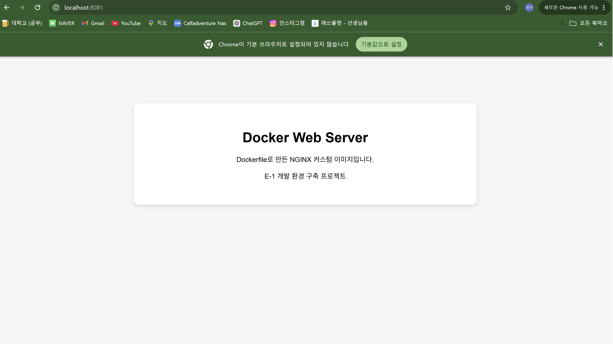
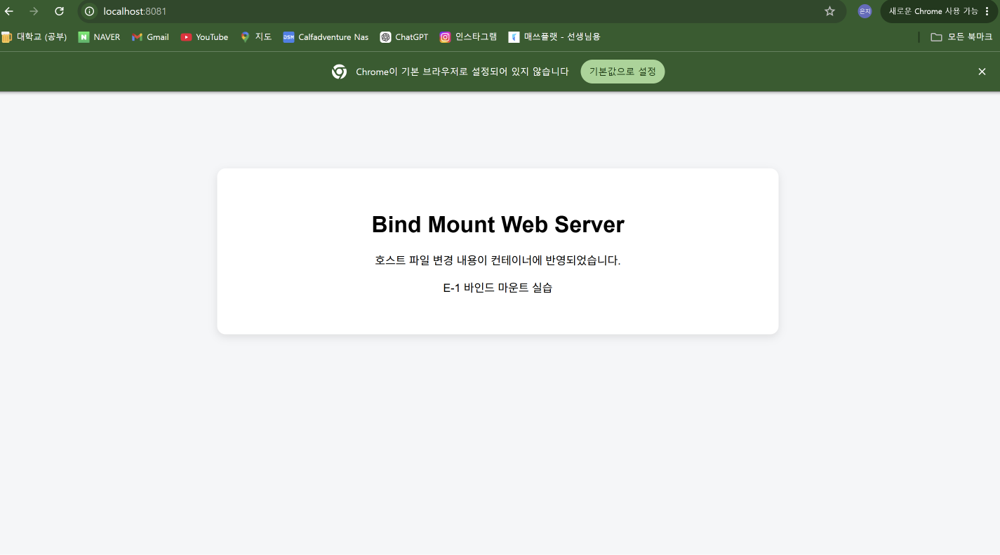
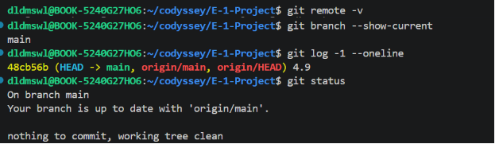
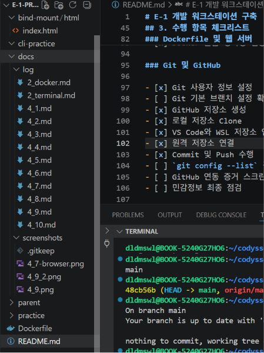

# E-1 개발 워크스테이션 구축

## 1. 프로젝트 개요

이 프로젝트는 Linux CLI, Docker, Git/GitHub를 활용하여 재현 가능한 개발 워크스테이션을 구축하고 검증하는 과제이다.

터미널을 이용한 파일 및 디렉토리 관리, 권한 변경, Docker 이미지와 컨테이너 운영, Dockerfile 기반 웹 서버 제작, 포트 매핑, 바인드 마운트, Docker 볼륨 영속성 검증을 수행한다.

각 실습은 명령어와 출력 결과를 기록하여 동일한 환경에서 다시 실행할 수 있도록 문서화하는 것을 목표로 한다.

---

## 2. 실행 환경

| 항목 | 환경 |
|---|---|
| 호스트 운영체제 | Windows 11, 빌드 26200.8655 |
| Linux 환경 | WSL2 |
| Linux 배포판 | Ubuntu 26.04 LTS |
| Shell | Bash (`/bin/bash`) |
| 터미널 | VS Code WSL Terminal |
| Git | 2.53.0 |
| Docker | 29.6.2 |
| Docker 실행 환경 | Docker Desktop + WSL2 |
| VS Code | 1.131.0 |

### 환경 확인 명령어

```bash
uname -a
cat /etc/os-release
echo $SHELL
git --version
docker --version
docker info
```

자세한 출력 결과는 아래 문서에 기록한다.

- [터미널 조작 로그](docs/log/2_terminal.md)
- [Docker 운영 및 검증 로그](/docs/log/2_docker.md)

---

## 3. 수행 항목 체크리스트

### 터미널 및 권한

- [x] 현재 위치 확인
- [x] 일반 파일 목록 확인
- [x] 숨김 파일 포함 목록 확인
- [x] 디렉토리 이동
- [x] 파일 및 디렉토리 생성
- [x] 파일 복사
- [x] 파일 이동 및 이름 변경
- [x] 파일 및 디렉토리 삭제
- [x] 파일 내용 확인
- [x] 빈 파일 생성
- [x] 파일 권한 변경 실습
- [x] 디렉토리 권한 변경 실습
- [x] `r`, `w`, `x` 권한 의미 정리
- [x] `644`, `755` 숫자 권한 의미 정리

### Docker

- [x] Docker Desktop 설치
- [x] WSL2와 Docker Desktop 연동
- [x] Docker 버전 확인
- [x] Docker 엔진 상태 확인
- [x] Docker 이미지 다운로드
- [x] Docker 이미지 목록 확인
- [x] 컨테이너 실행
- [x] 컨테이너 중지 및 재실행
- [x] 실행 중인 컨테이너 목록 확인
- [x] 전체 컨테이너 목록 확인
- [x] 컨테이너 로그 확인
- [x] 컨테이너 리소스 사용량 확인
- [x] `hello-world` 컨테이너 실행
- [x] Ubuntu 컨테이너 실행 및 내부 진입
- [x] `attach`와 `exec` 차이 확인

### Dockerfile 및 웹 서버

- [x] Dockerfile 작성
- [x] 웹 서버 소스코드 작성
- [x] 커스텀 이미지 빌드
- [x] 커스텀 컨테이너 실행
- [x] 포트 매핑 적용
- [x] 브라우저 접속 확인
- [x] `curl` 응답 확인
- [x] 바인드 마운트 변경 반영 확인
- [x] Docker 볼륨 생성
- [x] Docker 볼륨 영속성 검증

### Git 및 GitHub

- [x] Git 사용자 정보 설정
- [x] Git 기본 브랜치 설정 확인
- [x] GitHub 저장소 생성
- [x] 로컬 저장소 Clone
- [x] VS Code와 WSL 저장소 연결
- [x] 원격 저장소 연결
- [x] Commit 및 Push 수행
- [x] `git config --list` 결과 기록
- [x] GitHub 연동 증거 스크린샷 첨부
- [x] 민감정보 최종 점검

---

## 4. 수행 결과 및 검증 방법

## 4.1 터미널 조작 실습

현재 위치 확인, 목록 확인, 파일 생성, 복사, 이동, 이름 변경 및 삭제 작업을 수행한다.

### 검증 명령어

```bash
pwd
ls
ls -la
cd
mkdir
touch
cp
mv
cat
rm
rmdir
```

### 수행 결과

```
### 수행 결과

Linux CLI를 사용하여 다음 작업을 수행하였다.

- `pwd`로 현재 작업 디렉토리의 절대 경로를 확인하였다.
- `ls`로 일반 파일과 디렉토리 목록을 확인하였다.
- `ls -la`로 `.git`을 포함한 숨김 파일, 권한, 소유자와 파일 크기를 확인하였다.
- `cd`를 사용하여 하위 디렉토리와 상위 디렉토리로 이동하였다.
- `mkdir`과 `mkdir -p`를 사용하여 일반 디렉토리와 여러 단계의 디렉토리를 생성하였다.
- `touch`로 빈 파일을 생성하였다.
- `echo`와 `>`를 사용하여 파일에 내용을 작성하였다.
- `cp`로 파일을 복사하고 다른 디렉토리에도 복사하였다.
- `mv`로 파일 이름을 변경하고 파일을 다른 디렉토리로 이동하였다.
- `cat`으로 파일 내용을 확인하였다.
- `rm`으로 일반 파일을 삭제하였다.
- `rmdir`은 빈 디렉토리만 삭제할 수 있다는 것을 확인하였다.

실습 과정에서 `cd~`처럼 명령어와 경로 사이의 공백을 생략하거나, `rssult`처럼 경로 이름을 잘못 입력하면 명령어가 실행되지 않는 것도 확인하였다. 또한 파일이 들어 있는 디렉토리에 `rmdir`을 사용하면 `Directory not empty` 오류가 발생하며, 내부 파일을 먼저 삭제해야 한다는 것을 확인하였다.
```

### 상세 기록

[터미널 조작 로그 보기](docs/log/4_1.md)

---

## 4.2 파일 및 디렉토리 권한 실습

파일 1개와 디렉토리 1개를 대상으로 권한을 확인하고 변경한다.

### 검증 명령어

파일과 디렉토리의 권한을 변경하고, 변경 전과 변경 후의 상태를 확인하였다.

```bash
chmod
ls -ld
```

### 파일 권한 변경 결과

`permission-file.txt` 파일의 권한을 `600`에서 `644`로 변경하였다.

```text
변경 전: -rw-------  (600)
변경 후: -rw-r--r--  (644)
```

변경 전에는 파일 소유자만 읽기와 쓰기가 가능했다.

변경 후에는 소유자는 읽기와 쓰기가 가능하고, 그룹 사용자와 기타 사용자는 파일을 읽을 수 있게 되었다.

### 디렉토리 권한 변경 결과

`permission-dir` 디렉토리의 권한을 `700`에서 `755`로 변경하였다.

```text
변경 전: drwx------  (700)
변경 후: drwxr-xr-x  (755)
```

변경 전에는 디렉토리 소유자만 읽기, 쓰기 및 내부 접근이 가능했다.

변경 후에는 소유자는 모든 권한을 가지며, 그룹 사용자와 기타 사용자는 디렉토리 목록을 확인하고 내부에 접근할 수 있게 되었다.

### 권한 설명

- `r`: 읽기 권한을 의미한다. 파일에서는 내용을 읽을 수 있고, 디렉토리에서는 내부 목록을 확인할 수 있다.
- `w`: 쓰기 권한을 의미한다. 파일에서는 내용을 수정할 수 있고, 디렉토리에서는 내부 파일을 생성·삭제하거나 이름을 변경할 수 있다.
- `x`: 실행 또는 접근 권한을 의미한다. 파일에서는 실행할 수 있고, 디렉토리에서는 내부로 이동하고 항목에 접근할 수 있다.
- `644`: 소유자는 읽기와 쓰기가 가능하며, 그룹 사용자와 기타 사용자는 읽기만 가능하다.
- `755`: 소유자는 읽기·쓰기·접근이 모두 가능하며, 그룹 사용자와 기타 사용자는 읽기와 접근만 가능하다.

숫자 권한은 각 권한값을 더하여 계산한다.

```text
r = 4
w = 2
x = 1
```

```text
644 = rw-r--r--
755 = rwxr-xr-x
```

### 상세 기록

[파일 및 디렉토리 권한 실습 로그 보기](docs/log/4_2.md)

---


## 4.3 Docker 이미지 관리

Docker 이미지를 다운로드하고 이미지 목록을 확인한다.

### 실행 명령어

```bash
docker pull 이미지명
docker images
```

### 사용한 이미지

```text
ubuntu:24.04
```

### 실행 결과

Docker Hub에서 `ubuntu:24.04` 이미지를 정상적으로 다운로드하였다.

```text
이미지 이름 및 태그: ubuntu:24.04
이미지 ID: 561618e2c15b
디스크 사용량: 119MB
콘텐츠 크기: 31.7MB
```

`docker images` 명령어를 통해 이미지가 로컬 Docker 환경에 정상적으로 저장된 것을 확인하였다.

### 상세 기록

[Docker 이미지 관리 로그 보기](docs/log/4_3.md)

---

## 4.4 Docker 컨테이너 기본 운영

`ubuntu:24.04` 이미지로 컨테이너를 생성하고 실행 상태, 로그 및 자원 사용량을 확인하였다.

컨테이너를 중지한 뒤 다시 시작하여 Docker 컨테이너의 기본 운영 방법을 실습하였다.

### 실행 명령어

```bash
docker run -d --name ubuntu-practice ubuntu:24.04 sh -c 'while true; do echo "Ubuntu container is running"; sleep 10; done'
docker ps
docker ps -a
docker logs ubuntu-practice
docker stats ubuntu-practice --no-stream
docker stop ubuntu-practice
docker start ubuntu-practice
docker logs --tail 5 ubuntu-practice
```

### 실행 결과

`ubuntu:24.04` 이미지로 `ubuntu-practice` 컨테이너를 정상적으로 생성하고 백그라운드에서 실행하였다.

```text
컨테이너 이름: ubuntu-practice
컨테이너 ID: a1aa86e1ecfd
사용 이미지: ubuntu:24.04
실행 상태: Up
```

`docker logs`를 통해 컨테이너 내부에서 다음 문자열이 약 10초마다 출력되는 것을 확인하였다.

```text
Ubuntu container is running
```

`docker stats`를 사용하여 컨테이너의 자원 사용량도 확인하였다.

```text
CPU 사용률: 0.00%
메모리 사용량: 3.328MiB / 15.37GiB
메모리 사용률: 0.02%
실행 프로세스 수: 2
```

컨테이너를 중지한 뒤 `docker ps`에서는 표시되지 않고, `docker ps -a`에서는 `Exited` 상태로 표시되는 것을 확인하였다.

이후 `docker start ubuntu-practice` 명령어로 기존 컨테이너를 다시 실행하고 최근 로그 5줄을 확인하였다.

실습 종료 후 컨테이너는 다시 중지하였다.

### 수행 결과

- [x] 컨테이너 생성 및 실행
- [x] 실행 중인 컨테이너 확인
- [x] 전체 컨테이너 확인
- [x] 컨테이너 로그 확인
- [x] 컨테이너 자원 사용량 확인
- [x] 컨테이너 중지
- [x] 중지된 컨테이너 재시작
- [x] 실습 종료 후 컨테이너 중지

### 상세 기록

[Docker 컨테이너 기본 운영 로그 보기](docs/log/4_4.md)

---

## 4.5 hello-world 컨테이너 실행

Docker가 이미지를 내려받고 컨테이너를 정상적으로 생성하고 실행할 수 있는지 확인하기 위해 `hello-world` 이미지를 실행하였다.

### 실행 명령어

```bash
docker run hello-world
docker ps -a
```

### 실행 결과

로컬 환경에 `hello-world:latest` 이미지가 없었기 때문에 Docker Hub에서 이미지가 자동으로 다운로드되었다.

```text
Status: Downloaded newer image for hello-world:latest
```

이미지 다운로드 후 다음 문구가 정상적으로 출력되었다.

```text
Hello from Docker!
This message shows that your installation appears to be working correctly.
```

이를 통해 다음 과정이 정상적으로 수행된 것을 확인하였다.

```text
Docker 클라이언트와 Docker 데몬 연결
Docker Hub에서 이미지 다운로드
hello-world 컨테이너 생성
컨테이너 내부 프로그램 실행
결과를 터미널에 출력
```

### 검증 결과

`docker ps -a` 명령어를 사용하여 컨테이너의 종료 상태를 확인하였다.

```text
컨테이너 ID: 65d11b3ee6a6
사용 이미지: hello-world
컨테이너 이름: vigorous_brahmagupta
종료 상태: Exited (0)
```

`hello-world` 컨테이너는 안내 문구를 출력한 뒤 자동으로 종료된다.

`Exited (0)`은 컨테이너 내부의 프로그램이 오류 없이 정상적으로 작업을 완료했다는 뜻이다.

### 수행 결과

- [x] hello-world 이미지 다운로드
- [x] hello-world 컨테이너 생성 및 실행
- [x] `Hello from Docker!` 출력 확인
- [x] Docker 설치 및 연결 상태 검증
- [x] 컨테이너 정상 종료 확인

### 상세 기록

[hello-world 컨테이너 실행 로그 보기](docs/log/4_5.md)

---

## 4.6 Ubuntu 컨테이너 실행 및 내부 진입

`ubuntu:24.04` 이미지로 대화형 컨테이너를 생성하고 Bash 터미널에 직접 진입하였다.

컨테이너 내부에서 기본 Linux 명령어와 운영체제 정보를 확인하고, `docker attach`와 `docker exec`를 사용하여 실행 중인 컨테이너에 접속하였다.

### 컨테이너 생성 및 내부 진입

```bash
docker run -it --name ubuntu-shell ubuntu:24.04 bash
```

컨테이너 내부에서 다음 명령어를 실행하였다.

```bash
pwd
ls
echo "Hello Docker"
cat /etc/os-release
```

### 실행 결과

```text
컨테이너 이름: ubuntu-shell
컨테이너 ID: 9391942d87da
사용 이미지: ubuntu:24.04
컨테이너 내부 경로: /
운영체제: Ubuntu 24.04.4 LTS
```

컨테이너 내부에서 `exit`를 실행한 뒤 `docker ps -a`로 `Exited (0)` 상태를 확인하였다.

### docker attach 실습

```bash
docker start ubuntu-shell
docker attach --detach-keys="x" ubuntu-shell
```

`docker attach`를 사용하여 실행 중인 컨테이너의 기존 주 터미널에 연결하였다.

VS Code 터미널에서 기본 분리 키가 동작하지 않아 `--detach-keys="x"` 옵션을 사용하여 소문자 `x`를 분리 키로 지정하였다.

```text
Attached to container
read escape sequence
```

분리 후 `docker ps`를 실행한 결과 컨테이너가 계속 `Up` 상태로 실행되는 것을 확인하였다.

### docker exec 실습

```bash
docker exec -it ubuntu-shell bash
```

컨테이너 내부에서 다음 명령어를 실행하였다.

```bash
echo "Entered with docker exec"
pwd
exit
```

실행 결과는 다음과 같다.

```text
Entered with docker exec
/
```

`docker exec`로 실행한 Bash에서 `exit`를 입력해도 원래 컨테이너는 계속 `Up` 상태로 실행되는 것을 확인하였다.

### 중지 상태에서 exec 실행

중지된 컨테이너에서 `docker exec`를 실행했을 때 다음 오류가 발생하였다.

```text
Error response from daemon: container ... is not running
```

`docker exec`는 실행 중인 컨테이너에서만 사용할 수 있으므로 다음과 같이 컨테이너를 먼저 시작하여 해결하였다.

```bash
docker start ubuntu-shell
docker exec -it ubuntu-shell bash
```

### attach와 exec 차이

| 명령어 | 설명 |
|---|---|
| `docker attach` | 실행 중인 컨테이너의 기존 주 터미널에 연결 |
| `docker exec` | 실행 중인 컨테이너 내부에서 새로운 명령어나 셸을 실행 |

`attach` 상태에서 `exit`를 입력하면 컨테이너의 주 프로세스가 종료되어 컨테이너도 중지될 수 있다.

반면 `exec`로 실행한 Bash에서 `exit`를 입력하면 추가로 실행한 Bash만 종료되며 원래 컨테이너는 계속 실행된다.

### 수행 결과

- [x] Ubuntu 컨테이너 생성 및 실행
- [x] 컨테이너 내부 Bash 진입
- [x] 컨테이너 내부 Linux 명령어 실행
- [x] Ubuntu 버전 확인
- [x] 중지된 컨테이너 재실행
- [x] `docker attach`로 기존 터미널 연결
- [x] 컨테이너를 중지하지 않고 attach 연결 종료
- [x] `docker exec`로 새로운 Bash 실행
- [x] exec 종료 후 컨테이너 실행 상태 확인
- [x] 중지 상태에서 exec 실행 오류 확인 및 해결
- [x] `attach`와 `exec` 차이 확인
- [x] 실습 종료 후 컨테이너 중지

### 상세 기록

[Ubuntu 컨테이너 실행 및 내부 진입 로그 보기](docs/log/4_6.md)

---

## 4.7 Dockerfile 기반 커스텀 이미지

NGINX Alpine 이미지를 베이스 이미지로 사용하고, 직접 작성한 HTML 파일을 포함하는 커스텀 Docker 이미지를 제작하였다.

### 선택한 방식

NGINX Alpine 베이스 이미지에 정적 HTML 파일을 복사하여 간단한 웹 서버를 구성하였다.

Alpine 기반 이미지를 선택하여 비교적 가벼운 크기의 웹 서버 이미지를 제작하였다.

### 선택한 베이스 이미지

```text
nginx:alpine
```

### Dockerfile

```dockerfile
FROM nginx:alpine

COPY app/ /usr/share/nginx/html/

EXPOSE 80
```

- `FROM`: NGINX Alpine 이미지를 베이스 이미지로 사용
- `COPY`: `app` 폴더의 웹페이지 파일을 NGINX 기본 웹 경로로 복사
- `EXPOSE`: 컨테이너 내부의 80번 포트 사용을 표시

### 웹 서버 소스코드

```text
app/index.html
```

웹페이지에는 다음 내용을 작성하였다.

```text
Docker Web Server
Dockerfile로 만든 NGINX 커스텀 이미지입니다.
E-1 개발 환경 구축 프로젝트
```

### 이미지 빌드 명령어

```bash
docker build -t e1-nginx:1.0 .
```

### 이미지 빌드 결과

```text
이미지 이름과 태그: e1-nginx:1.0
이미지 ID: 9546c3e213ce
디스크 사용량: 92.7MB
콘텐츠 크기: 26.1MB
빌드 상태: FINISHED
```

### 컨테이너 실행 명령어

```bash
docker run -d --name e1-nginx-container -p 127.0.0.1:8080:80 e1-nginx:1.0
```

### 컨테이너 실행 결과

```text
컨테이너 이름: e1-nginx-container
컨테이너 ID: 9a0434d9b1ee
사용 이미지: e1-nginx:1.0
실행 상태: Up
포트 매핑: 127.0.0.1:8080 → 80/tcp
```

### curl 응답 확인

```bash
curl http://localhost:8080
```

작성한 HTML 문서가 터미널에 정상적으로 출력되었다.

```text
Docker Web Server
Dockerfile로 만든 NGINX 커스텀 이미지입니다.
E-1 개발 환경 구축 프로젝트
```

### 브라우저 실행 화면


Windows Chrome 브라우저에서 다음 주소로 접속하였다.

```text
http://localhost:8080
```

직접 작성한 웹페이지가 정상적으로 표시되어 커스텀 Docker 이미지, NGINX 서버 및 포트 매핑이 정상적으로 작동하는 것을 확인하였다.

<!-- 스크린샷을 저장한 뒤 아래 주석을 제거한다.

-->

### 수행 결과

- [x] NGINX Alpine 베이스 이미지 선택
- [x] 웹 서버 HTML 파일 작성
- [x] Dockerfile 작성
- [x] 커스텀 이미지 빌드
- [x] 커스텀 이미지 목록 확인
- [x] 커스텀 컨테이너 실행
- [x] 포트 매핑 적용
- [x] `curl` 응답 확인
- [x] 웹 브라우저 접속 확인
- [x] 직접 작성한 웹페이지 표시 확인

### 상세 기록

[Dockerfile 기반 커스텀 이미지 로그 보기](docs/log/4_7.md)

---

## 4.8 포트 매핑 및 웹 접속

커스텀 NGINX 컨테이너의 내부 80번 포트를 호스트의 8080번 포트와 연결하였다.

`curl`과 Windows Chrome 브라우저를 사용하여 웹 서버 접속 및 HTTP 응답 상태를 확인하였다.

### 실행 명령어

```bash
docker run -d \
  -p 127.0.0.1:8080:80 \
  --name e1-nginx-container \
  e1-nginx:1.0
```

기존에 생성한 컨테이너가 중지된 경우 다음 명령어로 다시 실행하였다.

```bash
docker start e1-nginx-container
```

### 포트 매핑 확인

```bash
docker ps
```

확인 결과는 다음과 같다.

```text
컨테이너 이름: e1-nginx-container
컨테이너 ID: 9a0434d9b1ee
이미지: e1-nginx:1.0
실행 상태: Up
포트 매핑: 127.0.0.1:8080 → 80/tcp
```

### 접속 주소

```text
http://localhost:8080
```

### curl 응답 확인

HTTP 응답 헤더를 확인하였다.

```bash
curl -I http://localhost:8080
```

```text
HTTP/1.1 200 OK
Server: nginx/1.31.3
Content-Type: text/html
Content-Length: 884
```

`200 OK`가 출력되어 웹 서버가 요청을 정상적으로 처리하는 것을 확인하였다.

HTML 본문도 확인하였다.

```bash
curl http://localhost:8080
```

직접 작성한 HTML 문서가 터미널에 정상적으로 출력되었다.

```text
Docker Web Server
Dockerfile로 만든 NGINX 커스텀 이미지입니다.
E-1 개발 환경 구축 프로젝트
```

### 브라우저 접속 결과

Windows Chrome 브라우저에서 `http://localhost:8080`으로 접속하였다.

직접 작성한 웹페이지가 정상적으로 표시되어 포트 매핑과 NGINX 웹 서버가 정상적으로 작동하는 것을 확인하였다.

### 증거 이미지


### NGINX 로그 확인

```bash
docker logs --tail 20 e1-nginx-container
```

다음 요청과 응답 상태를 확인하였다.

```text
HEAD / HTTP/1.1 → 200
GET / HTTP/1.1 → 200
Chrome GET / HTTP/1.1 → 304
```

`200`은 요청이 정상 처리되었다는 뜻이며, `304`는 페이지가 변경되지 않아 브라우저 캐시를 사용했다는 뜻이다.

### 수행 결과

- [x] NGINX 컨테이너 실행
- [x] 호스트 포트와 컨테이너 포트 연결
- [x] 포트 매핑 상태 확인
- [x] `curl -I` 응답 확인
- [x] HTTP 상태 코드 `200 OK` 확인
- [x] `curl` HTML 본문 확인
- [x] Windows 브라우저 접속 확인
- [x] NGINX 접속 로그 확인
- [x] 증거 이미지 첨부

### 상세 기록

[포트 매핑 및 웹 접속 로그 보기](docs/log/4_8.md)

---

## 4.9 바인드 마운트

호스트의 HTML 파일을 NGINX 컨테이너 내부 웹 문서 경로와 연결하였다.

호스트 파일을 수정한 뒤 컨테이너를 다시 빌드하거나 재시작하지 않아도 웹페이지에 변경 내용이 즉시 반영되는지 확인하였다.

### 실행 명령어

```bash
cd ~/codyssey/E-1-Project
mkdir -p bind-mount/html
cp app/index.html bind-mount/html/index.html

docker run -d \
  --name e1-bind-container \
  -p 127.0.0.1:8081:80 \
  -v "$(pwd)/bind-mount/html:/usr/share/nginx/html:ro" \
  nginx:alpine
```

### 바인드 마운트 설정

```text
호스트 경로:
bind-mount/html

컨테이너 경로:
/usr/share/nginx/html

마운트 모드:
읽기 전용(ro)

호스트 포트:
8081

컨테이너 포트:
80
```

### 변경 전 결과

```bash
curl http://localhost:8081
```

변경 전 웹페이지에는 다음 내용이 표시되었다.

```text
Docker Web Server
Dockerfile로 만든 NGINX 커스텀 이미지입니다.
E-1 개발 환경 구축 프로젝트
```

#### 변경 전 화면



### 호스트 파일 수정 내용

호스트의 `bind-mount/html/index.html` 파일을 다음과 같이 수정하였다.

```html
<h1>Bind Mount Web Server</h1>
<p>호스트 파일 변경 내용이 컨테이너에 반영되었습니다.</p>
<p>E-1 바인드 마운트 실습</p>
```

### 변경 후 결과

컨테이너를 다시 빌드하거나 재시작하지 않고 다음 명령어를 실행하였다.

```bash
curl http://localhost:8081
```

변경 후 웹페이지에는 다음 내용이 표시되었다.

```text
Bind Mount Web Server
호스트 파일 변경 내용이 컨테이너에 반영되었습니다.
E-1 바인드 마운트 실습
```

#### 변경 후 화면



### 컨테이너 내부 파일 확인

```bash
docker exec e1-bind-container cat /usr/share/nginx/html/index.html
```

컨테이너 내부에서도 수정된 HTML 내용이 확인되었다.

### 마운트 설정 확인

```bash
docker inspect e1-bind-container --format='{{json .Mounts}}'
```

확인 결과는 다음과 같다.

```text
Type: bind
Source: /home/dldmswl/codyssey/E-1-Project/bind-mount/html
Destination: /usr/share/nginx/html
Mode: ro
RW: false
```

`RW:false`는 컨테이너에서 마운트된 호스트 경로를 읽기만 할 수 있음을 의미한다.

### 검증 결과

- [x] 호스트 디렉토리와 컨테이너 경로 연결
- [x] 바인드 마운트 컨테이너 실행
- [x] 변경 전 웹페이지 확인
- [x] 호스트 HTML 파일 수정
- [x] 컨테이너 재시작 없이 변경 내용 확인
- [x] 브라우저 변경 전후 화면 확인
- [x] 컨테이너 내부 파일 변경 확인
- [x] 바인드 마운트 설정 확인
- [x] 읽기 전용 연결 확인

### 상세 기록

[바인드 마운트 실습 로그 보기](docs/log/4_9.md)

---

## 4.10 Docker 볼륨 영속성

Docker 볼륨에 데이터를 저장한 뒤 기존 컨테이너를 삭제하고, 새로운 컨테이너에서 동일한 데이터를 확인하여 볼륨의 영속성을 검증하였다.

### 볼륨 생성 명령어

```bash
docker volume create e1-data-volume
```

생성된 볼륨을 확인하였다.

```bash
docker volume ls
```

```text
DRIVER    VOLUME NAME
local     e1-data-volume
```

### 볼륨 연결 및 데이터 저장

`ubuntu:24.04` 컨테이너의 `/data` 디렉토리에 `e1-data-volume`을 연결하였다.

```bash
docker run --name volume-test-1 \
  -v e1-data-volume:/data \
  ubuntu:24.04 \
  bash -c 'echo "Docker volume data persists" > /data/persistence.txt && cat /data/persistence.txt'
```

실행 결과는 다음과 같다.

```text
Docker volume data persists
```

### 기존 컨테이너 삭제

첫 번째 컨테이너의 상태가 `Exited (0)`인 것을 확인한 뒤 컨테이너를 삭제하였다.

```bash
docker rm volume-test-1
```

```text
volume-test-1
```

컨테이너 삭제 후에도 볼륨은 유지되었다.

```bash
docker volume ls
```

```text
DRIVER    VOLUME NAME
local     e1-data-volume
```

### 새로운 컨테이너에서 데이터 확인

새로운 컨테이너에 기존 볼륨을 다시 연결하고 저장된 파일을 확인하였다.

```bash
docker run --rm --name volume-test-2 \
  -v e1-data-volume:/data \
  ubuntu:24.04 \
  cat /data/persistence.txt
```

실행 결과는 다음과 같다.

```text
Docker volume data persists
```

첫 번째 컨테이너를 삭제한 이후에도 새로운 컨테이너에서 기존 파일을 확인할 수 있었다.

이를 통해 데이터가 컨테이너가 아닌 Docker 볼륨에 저장되어 유지된다는 것을 검증하였다.

### 영속성 검증 결과

```text
첫 번째 컨테이너에서 파일 생성
        ↓
첫 번째 컨테이너 삭제
        ↓
Docker 볼륨 유지
        ↓
새로운 컨테이너에 같은 볼륨 연결
        ↓
기존 파일 내용 확인 성공
```

### 수행 결과

- [x] Docker 볼륨 생성
- [x] Docker 볼륨 목록 확인
- [x] 컨테이너에 볼륨 연결
- [x] 볼륨에 데이터 저장
- [x] 기존 컨테이너 삭제
- [x] 컨테이너 삭제 후 볼륨 유지 확인
- [x] 새로운 컨테이너에 기존 볼륨 연결
- [x] 기존 데이터 확인
- [x] Docker 볼륨 영속성 검증

### 상세 기록

[Docker 볼륨 영속성 로그 보기](docs/log/4_10.md)

---

## 4.11 Git 설정 및 GitHub 연동

Git 사용자 정보와 기본 브랜치를 설정하고, 로컬 저장소가 GitHub 원격 저장소와 정상적으로 연결되어 있는지 확인하였다.

### Git 설정 확인

```bash
git config --list
```

실행 결과:

```text
user.name=이은지
user.email=dldmswl******@naver.com
init.defaultbranch=main
core.repositoryformatversion=0
core.filemode=true
core.bare=false
core.logallrefupdates=true
remote.origin.url=https://github.com/dldma/E-1-Project.git
remote.origin.fetch=+refs/heads/*:refs/remotes/origin/*
branch.main.remote=origin
branch.main.merge=refs/heads/main
branch.main.vscode-merge-base=origin/main
```

Git 사용자 이름과 이메일이 설정되어 있으며, 새로운 저장소의 기본 브랜치가 `main`으로 지정되어 있음을 확인하였다.

공개 문서에는 개인 이메일 주소 전체가 노출되지 않도록 일부 문자를 가려서 기록하였다.

### Git 기본 브랜치 확인

```bash
git config --global init.defaultBranch
```

실행 결과:

```text
main
```

처음 확인했을 때는 결과가 출력되지 않아 다음 명령어로 기본 브랜치를 설정하였다.

```bash
git config --global init.defaultBranch main
```

설정 후 다시 확인한 결과 기본 브랜치가 `main`으로 정상적으로 지정되었다.

### 원격 저장소 확인

```bash
git remote -v
```

실행 결과:

```text
origin  https://github.com/dldma/E-1-Project.git (fetch)
origin  https://github.com/dldma/E-1-Project.git (push)
```

GitHub의 `E-1-Project` 저장소가 `origin`이라는 이름으로 연결되어 있다.

- `fetch`: GitHub에서 변경 내용을 가져올 때 사용
- `push`: 로컬 커밋을 GitHub에 업로드할 때 사용

원격 저장소 주소에 GitHub 토큰이나 비밀번호가 포함되지 않은 것도 확인하였다.

### 현재 브랜치 확인

```bash
git branch --show-current
```

실행 결과:

```text
main
```

현재 작업 중인 로컬 브랜치는 `main`이다.

### 최근 커밋 확인

```bash
git log -1 --oneline
```

확인 당시 실행 결과:

```text
48cb56b (HEAD -> main, origin/main, origin/HEAD) 4.9
```

`HEAD`, 로컬 `main`, 원격 `origin/main`이 동일한 커밋을 가리키고 있어 로컬 저장소와 GitHub 원격 저장소가 동기화된 상태임을 확인하였다.

### 저장소 상태 확인

```bash
git status
```

실행 결과:

```text
On branch main
Your branch is up to date with 'origin/main'.

nothing to commit, working tree clean
```

현재 로컬 `main` 브랜치가 원격 `origin/main` 브랜치와 동일한 상태이며, 커밋하지 않은 변경 사항이 없는 것을 확인하였다.

### GitHub 연동 결과

원격 저장소의 최신 정보를 가져온 뒤 브랜치 상태를 확인하였다.

```bash
git fetch origin
git status -sb
```

실행 결과:

```text
## main...origin/main
```

`git fetch origin`은 오류 없이 실행되었으며 새롭게 가져올 변경 사항이 없어 별도의 출력은 나타나지 않았다.

`main...origin/main`이 표시되고 앞서거나 뒤처진 커밋 수가 나타나지 않았으므로 로컬 브랜치와 원격 브랜치가 동일한 상태이다.

### 연동 증거

#### 원격 저장소와 브랜치 확인



#### VS Code 저장소 상태 확인



스크린샷을 통해 다음 내용을 확인하였다.

```text
GitHub 원격 저장소 주소
fetch 및 push 연결
현재 브랜치 main
최근 커밋
origin/main 동기화 상태
working tree clean 상태
```

### 민감정보 점검

- [x] GitHub 토큰 미포함
- [x] 비밀번호 미포함
- [x] 인증 정보가 포함된 원격 저장소 주소 미사용
- [x] 공개 문서에서 개인 이메일 일부 가림
- [x] 스크린샷에 토큰 및 비밀번호 미포함

### 수행 결과

- [x] Git 사용자 이름 설정 확인
- [x] Git 사용자 이메일 설정 확인
- [x] Git 기본 브랜치를 `main`으로 설정
- [x] GitHub 원격 저장소 연결 확인
- [x] fetch 및 push 주소 확인
- [x] 현재 브랜치 `main` 확인
- [x] 최근 커밋 확인
- [x] 로컬 및 원격 브랜치 동기화 확인
- [x] 작업 트리 상태 확인
- [x] GitHub 연동 증거 첨부
- [x] 민감정보 최종 점검

### 상세 기록

[Git 설정 및 GitHub 연동 로그 보기](docs/log/4_11.md)

---

# 5. 트러블슈팅

실습 중 발생한 문제의 원인과 해결 과정을 기록하였다.

## 트러블슈팅 1: Git 저장소 인식 오류

Git 저장소가 아닌 `~/codyssey` 디렉토리에서 `git add .`을 실행하여 다음 오류가 발생하였다.

```text
fatal: not a git repository (or any of the parent directories): .git
```

실제 저장소인 `E-1-Project` 디렉토리로 이동하여 해결하였다.

```bash
cd ~/codyssey/E-1-Project
git status
git add .
```

## 트러블슈팅 2: 중지된 컨테이너에서 exec 실행

중지된 `ubuntu-shell` 컨테이너에서 `docker exec`를 실행하여 다음 오류가 발생하였다.

```text
Error response from daemon: container ... is not running
```

컨테이너를 먼저 실행한 뒤 `docker exec`를 다시 사용하여 해결하였다.

```bash
docker start ubuntu-shell
docker ps
docker exec -it ubuntu-shell bash
```

`docker exec`는 실행 중인 컨테이너에서만 사용할 수 있음을 확인하였다.

자세한 오류와 해결 과정은 아래 문서에 기록하였다.

[트러블슈팅 기록 보기](docs/log/5_troubleshooting.md)

---

# 6. 저장소 구조

```text
E-1-Project/
├── README.md
├── Dockerfile
├── app/
│   └── index.html
├── bind-mount/
│   └── html/
│       └── index.html
├── cli-practice/
├── parent/
│   └── child/
├── practice/
│   └── permission-practice/
│       ├── permission-dir/
│       └── permission-file.txt
└── docs/
    ├── log/
    │   ├── 2_docker.md
    │   ├── 2_terminal.md
    │   ├── 4_1.md
    │   ├── 4_2.md
    │   ├── 4_3.md
    │   ├── 4_4.md
    │   ├── 4_5.md
    │   ├── 4_6.md
    │   ├── 4_7.md
    │   ├── 4_8.md
    │   ├── 4_9.md
    │   ├── 4_10.md
    │   ├── 4_11.md
    │   └── 5_troubleshooting.md
    └── screenshots/
        ├── .gitkeep
        ├── 4_7-browser.png
        ├── 4_9.png
        ├── 4_9_2.png
        ├── 4_11.png
        └── 4_11_2.png
```

## 폴더 및 파일 용도

| 경로 | 용도 |
|---|---|
| `README.md` | 프로젝트 전체 실습 과정과 결과 정리 |
| `Dockerfile` | NGINX 기반 커스텀 Docker 이미지 제작 설정 |
| `app/index.html` | 커스텀 이미지에 포함되는 웹페이지 소스코드 |
| `bind-mount/html/index.html` | 바인드 마운트 변경 반영 실습용 웹페이지 |
| `cli-practice/` | Linux 터미널 기본 명령어 실습 디렉토리 |
| `parent/child/` | 중첩 디렉토리 생성 실습 결과 |
| `practice/permission-practice/` | 파일 및 디렉토리 권한 변경 실습 자료 |
| `docs/log/` | 항목별 명령어, 실행 결과 및 결과 설명 |
| `docs/screenshots/` | 브라우저와 터미널 실행 결과 증거 이미지 |

---

# 7. 문서 및 결과 링크

## 실행 환경 및 터미널

- [Linux 및 Git 실행 환경 확인](docs/log/2_terminal.md)
- [Docker 설치 및 엔진 상태 확인](docs/log/2_docker.md)
- [터미널 기본 조작 실습](docs/log/4_1.md)
- [파일 및 디렉토리 권한 실습](docs/log/4_2.md)

## Docker 이미지 및 컨테이너

- [Docker 이미지 관리](docs/log/4_3.md)
- [Docker 컨테이너 기본 운영](docs/log/4_4.md)
- [hello-world 컨테이너 실행](docs/log/4_5.md)
- [Ubuntu 컨테이너 실행 및 내부 진입](docs/log/4_6.md)

## Dockerfile 및 웹 서버

- [Dockerfile 기반 커스텀 이미지](docs/log/4_7.md)
- [포트 매핑 및 웹 접속](docs/log/4_8.md)
- [바인드 마운트](docs/log/4_9.md)
- [Docker 볼륨 영속성](docs/log/4_10.md)

## Git 및 문제 해결

- [Git 설정 및 GitHub 연동](docs/log/4_11.md)
- [트러블슈팅 기록](docs/log/5_troubleshooting.md)

## 증거 자료

- [스크린샷 폴더](docs/screenshots/)

---

# 8. 보안 및 개인정보 보호

공개 GitHub 저장소에 인증 정보와 개인정보가 포함되지 않도록 다음 원칙을 적용하였다.

- GitHub Personal Access Token은 저장소에 기록하지 않는다.
- GitHub 및 Ubuntu 비밀번호는 문서에 기록하지 않는다.
- 개인키와 인증 코드는 Git에 추가하지 않는다.
- 민감정보가 포함된 화면은 캡처하지 않거나 필요한 부분을 가린다.
- GitHub에 Push하기 전에 문서와 소스코드의 민감정보 포함 여부를 확인한다.
- 공개 로그에는 개인 이메일 주소 전체를 표시하지 않는다.
- 원격 저장소 주소에 토큰이나 비밀번호를 포함하지 않는다.

## 보안 점검 명령어

```bash
git grep -nEi 'ghp_[A-Za-z0-9]+|github_pat_[A-Za-z0-9_]+|AKIA[0-9A-Z]{16}|-----BEGIN .*PRIVATE KEY-----'
git grep -nEi 'password\s*=|passwd\s*=|secret\s*=|api[_-]?key\s*='
git remote -v
git status
```

## 보안 점검 결과

- [x] README에 토큰이 포함되지 않았는지 확인
- [x] 터미널 로그에 비밀번호가 포함되지 않았는지 확인
- [x] 스크린샷에 인증 정보가 노출되지 않았는지 확인
- [x] 개인키 및 인증 코드가 포함되지 않았는지 확인
- [x] 원격 저장소 URL에 인증 정보가 포함되지 않았는지 확인
- [x] 공개 문서의 개인 이메일 일부 가림
- [x] Push 전 전체 파일 최종 확인

GitHub 원격 저장소 주소는 일반 HTTPS 형식으로 설정되어 있으며 토큰이나 비밀번호가 포함되지 않았다.

```text
https://github.com/dldma/E-1-Project.git
```