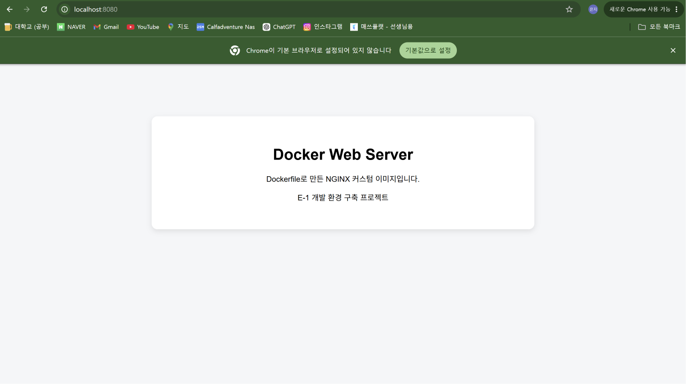

# 4.7 Dockerfile 기반 커스텀 이미지 로그

## 1. 실습 목적

NGINX 웹 서버를 기반으로 직접 작성한 HTML 파일을 제공하는 Docker 이미지를 제작하였다.

프로젝트에 `Dockerfile`과 웹페이지 소스코드를 작성한 뒤 커스텀 이미지를 빌드하고, 해당 이미지로 컨테이너를 실행하였다.

마지막으로 포트 매핑, `curl` 명령어 및 웹 브라우저를 사용하여 웹 서버가 정상적으로 작동하는지 확인하였다.

실습에 사용한 주요 이름은 다음과 같다.

```text
베이스 이미지: nginx:alpine
커스텀 이미지: e1-nginx:1.0
컨테이너 이름: e1-nginx-container
호스트 포트: 8080
컨테이너 포트: 80
```

---

## 2. 실습 파일 생성

### 설명

Dockerfile과 웹 서버에서 제공할 HTML 파일을 생성하였다.

웹페이지 파일은 프로젝트의 `app` 디렉토리에 저장하였다.

### 코드

```bash
cd ~/codyssey/E-1-Project
mkdir -p app
touch Dockerfile
touch app/index.html
```

### 결과

```text
출력 없음
```

### 결과 설명

다음 구조로 실습 파일이 생성되었다.

```text
E-1-Project/
├── Dockerfile
└── app/
    └── index.html
```

명령어가 정상적으로 실행되어 별도의 출력은 나타나지 않았다.

---

## 3. 웹 서버 소스코드 작성

### 설명

NGINX 웹 서버에서 표시할 정적 HTML 페이지를 `app/index.html`에 작성하였다.

페이지에는 Dockerfile로 만든 커스텀 웹 서버임을 나타내는 제목과 설명을 포함하였다.

### 코드

```html
<!DOCTYPE html>
<html lang="ko">
<head>
    <meta charset="UTF-8">
    <meta name="viewport" content="width=device-width, initial-scale=1.0">
    <title>E-1 Docker Web Server</title>
    <style>
        body {
            font-family: Arial, sans-serif;
            max-width: 800px;
            margin: 80px auto;
            padding: 30px;
            text-align: center;
            background-color: #f4f6f8;
        }

        main {
            padding: 40px;
            background-color: white;
            border-radius: 12px;
            box-shadow: 0 4px 12px rgba(0, 0, 0, 0.1);
        }

        h1 {
            margin-bottom: 20px;
        }
    </style>
</head>
<body>
    <main>
        <h1>Docker Web Server</h1>
        <p>Dockerfile로 만든 NGINX 커스텀 이미지입니다.</p>
        <p>E-1 개발 환경 구축 프로젝트</p>
    </main>
</body>
</html>
```

### 결과

```text
Docker Web Server
Dockerfile로 만든 NGINX 커스텀 이미지입니다.
E-1 개발 환경 구축 프로젝트
```

### 결과 설명

HTML 문서에는 다음 요소를 작성하였다.

- 웹페이지 제목
- 한글 문자 인코딩 설정
- 화면 크기에 대응하는 viewport 설정
- 간단한 CSS 디자인
- 커스텀 Docker 이미지 설명
- 프로젝트 이름

---

## 4. Dockerfile 작성

### 설명

NGINX Alpine 이미지를 베이스 이미지로 사용하여 커스텀 이미지를 만들기 위한 Dockerfile을 작성하였다.

### 코드

```dockerfile
FROM nginx:alpine

COPY app/ /usr/share/nginx/html/

EXPOSE 80
```

### 결과 설명

Dockerfile의 각 명령어 의미는 다음과 같다.

| 명령어 | 의미 |
|---|---|
| `FROM nginx:alpine` | NGINX Alpine 이미지를 베이스 이미지로 사용 |
| `COPY app/ /usr/share/nginx/html/` | 로컬 `app` 디렉토리의 파일을 NGINX 기본 웹 경로로 복사 |
| `EXPOSE 80` | 컨테이너 내부 웹 서버가 80번 포트를 사용함을 표시 |

`nginx:alpine`은 NGINX와 비교적 가벼운 Alpine Linux를 함께 사용하는 이미지이다.

---

## 5. Dockerfile 내용 확인

### 설명

`cat` 명령어를 사용하여 작성한 Dockerfile의 내용을 확인하였다.

### 코드

```bash
cat Dockerfile
```

### 결과

```text
FROM nginx:alpine

COPY app/ /usr/share/nginx/html/

EXPOSE 80
```

### 결과 설명

베이스 이미지, 웹페이지 복사 경로 및 컨테이너 포트가 계획한 내용과 동일하게 작성된 것을 확인하였다.

---

## 6. HTML 파일 내용 확인

### 설명

`head` 명령어를 사용하여 작성한 HTML 파일의 앞부분을 확인하였다.

### 코드

```bash
head app/index.html
```

### 결과

```text
<!DOCTYPE html>
<html lang="ko">
<head>
    <meta charset="UTF-8">
    <meta name="viewport" content="width=device-width, initial-scale=1.0">
    <title>E-1 Docker Web Server</title>
    <style>
        body {
            font-family: Arial, sans-serif;
            max-width: 800px;
```

### 결과 설명

`app/index.html`에 HTML 문서 구조와 CSS 코드가 정상적으로 저장된 것을 확인하였다.

---

## 7. 커스텀 Docker 이미지 빌드

### 설명

`docker build` 명령어를 사용하여 현재 디렉토리의 Dockerfile을 기반으로 커스텀 이미지를 생성하였다.

이미지 이름은 `e1-nginx`, 태그는 `1.0`으로 지정하였다.

### 코드

```bash
docker build -t e1-nginx:1.0 .
```

### 결과

```text
[+] Building 4.1s (7/7) FINISHED
 => [internal] load build definition from Dockerfile
 => [internal] load metadata for docker.io/library/nginx:alpine
 => [internal] load .dockerignore
 => [internal] load build context
 => [1/2] FROM docker.io/library/nginx:alpine
 => [2/2] COPY app/ /usr/share/nginx/html/
 => exporting to image
 => => exporting manifest sha256:a9d5d73587c2b82f1a4ae74398a40db0ead8534097c0875ff84bddd849364cb1
 => => exporting config sha256:a0dff0736a8d7b60669455f02909cb6e544eedb913df06e0977b37e03ff6b8da
 => => exporting manifest list sha256:9546c3e213ce0394fcf43c417901eef6b45d5e6307c972ea773bb958f6894e75
 => => naming to docker.io/library/e1-nginx:1.0
 => => unpacking to docker.io/library/e1-nginx:1.0
```

### 결과 설명

다음 작업이 정상적으로 수행되었다.

1. Dockerfile을 읽었다.
2. Docker Hub에서 `nginx:alpine` 베이스 이미지를 다운로드하였다.
3. `app` 디렉토리의 파일을 이미지 내부로 복사하였다.
4. 새로운 Docker 이미지 레이어를 생성하였다.
5. 이미지 이름과 태그를 `e1-nginx:1.0`으로 지정하였다.

다음 문구를 통해 이미지 빌드가 완료된 것을 확인하였다.

```text
FINISHED
naming to docker.io/library/e1-nginx:1.0
```

---

## 8. Docker 이미지 목록 확인

### 설명

`docker images` 명령어를 사용하여 빌드한 이미지가 로컬 Docker 환경에 저장되었는지 확인하였다.

### 코드

```bash
docker images
```

### 결과

```text
IMAGE                ID             DISK USAGE   CONTENT SIZE   EXTRA
e1-nginx:1.0         9546c3e213ce       92.7MB         26.1MB
hello-world:latest   c3cbe1cc1aa5       25.9kB         9.49kB    U
ubuntu:24.04         561618e2c15b        119MB         31.7MB    U
```

### 결과 설명

빌드한 커스텀 이미지 정보는 다음과 같다.

```text
이미지 이름과 태그: e1-nginx:1.0
이미지 ID: 9546c3e213ce
디스크 사용량: 92.7MB
콘텐츠 크기: 26.1MB
```

이미지 목록에 `e1-nginx:1.0`이 표시되어 빌드 결과가 정상적으로 저장된 것을 확인하였다.

---

## 9. 커스텀 이미지만 별도로 확인

### 설명

`docker image ls` 명령어 뒤에 이미지 이름을 지정하여 커스텀 이미지만 별도로 확인하였다.

### 코드

```bash
docker image ls e1-nginx
```

### 결과

```text
IMAGE          ID             DISK USAGE   CONTENT SIZE   EXTRA
e1-nginx:1.0   9546c3e213ce       92.7MB         26.1MB
```

### 결과 설명

`e1-nginx:1.0` 이미지가 정상적으로 생성되어 로컬에 존재하는 것을 다시 확인하였다.

---

## 10. 커스텀 컨테이너 실행

### 설명

직접 빌드한 `e1-nginx:1.0` 이미지를 사용하여 새로운 컨테이너를 실행하였다.

`-d` 옵션으로 백그라운드에서 실행하고, 컨테이너 이름을 `e1-nginx-container`로 지정하였다.

호스트의 `8080` 포트와 컨테이너의 `80` 포트를 연결하였다.

### 코드

```bash
docker run -d --name e1-nginx-container -p 127.0.0.1:8080:80 e1-nginx:1.0
```

### 결과

```text
9a0434d9b1eec0297dda8792be2e788ae81583ad2186f584942af5124a70dbc6
```

### 결과 설명

새로운 컨테이너가 정상적으로 생성되고 백그라운드에서 실행되었다.

```text
컨테이너 ID:
9a0434d9b1eec0297dda8792be2e788ae81583ad2186f584942af5124a70dbc6
```

포트 매핑 구조는 다음과 같다.

```text
Windows 및 WSL의 8080번 포트
          ↓
Docker 컨테이너의 80번 포트
          ↓
NGINX 웹 서버
```

---

## 11. 컨테이너 실행 상태 확인

### 설명

`docker ps` 명령어를 사용하여 커스텀 컨테이너의 실행 상태와 포트 매핑 정보를 확인하였다.

### 코드

```bash
docker ps
```

### 결과

```text
CONTAINER ID   IMAGE          COMMAND                  CREATED         STATUS         PORTS                    NAMES
9a0434d9b1ee   e1-nginx:1.0   "/docker-entrypoint.…"   7 seconds ago   Up 6 seconds   127.0.0.1:8080->80/tcp   e1-nginx-container
```

### 결과 설명

컨테이너의 주요 정보는 다음과 같다.

```text
컨테이너 ID: 9a0434d9b1ee
이미지: e1-nginx:1.0
실행 상태: Up 6 seconds
포트 매핑: 127.0.0.1:8080 → 80/tcp
컨테이너 이름: e1-nginx-container
```

`STATUS`가 `Up`으로 표시되어 컨테이너가 정상적으로 실행되고 있음을 확인하였다.

---

## 12. curl을 사용한 웹 서버 검증

### 설명

`curl` 명령어를 사용하여 터미널에서 `localhost:8080` 주소로 HTTP 요청을 보냈다.

`curl`은 웹 서버에 요청을 보내고 서버가 반환한 내용을 터미널에 표시하는 명령어이다.

### 코드

```bash
curl http://localhost:8080
```

### 결과

```html
<!DOCTYPE html>
<html lang="ko">
<head>
    <meta charset="UTF-8">
    <meta name="viewport" content="width=device-width, initial-scale=1.0">
    <title>E-1 Docker Web Server</title>
    <style>
        body {
            font-family: Arial, sans-serif;
            max-width: 800px;
            margin: 80px auto;
            padding: 30px;
            text-align: center;
            background-color: #f4f6f8;
        }

        main {
            padding: 40px;
            background-color: white;
            border-radius: 12px;
            box-shadow: 0 4px 12px rgba(0, 0, 0, 0.1);
        }

        h1 {
            margin-bottom: 20px;
        }
    </style>
</head>
<body>
    <main>
        <h1>Docker Web Server</h1>
        <p>Dockerfile로 만든 NGINX 커스텀 이미지입니다.</p>
        <p>E-1 개발 환경 구축 프로젝트</p>
    </main>
</body>
</html>
```

### 결과 설명

`app/index.html`에 작성한 HTML 전체 내용이 터미널에 출력되었다.

이를 통해 다음 사항을 확인하였다.

- 컨테이너의 NGINX 서버가 정상적으로 실행됨
- 호스트의 8080번 포트가 컨테이너의 80번 포트와 연결됨
- NGINX가 커스텀 HTML 파일을 정상적으로 반환함
- HTTP 요청과 응답이 정상적으로 처리됨

---

## 13. 웹 브라우저 접속 확인

### 브라우저 실행 화면



### 설명

Windows의 Chrome 브라우저 주소창에서 다음 주소로 접속하였다.

```text
http://localhost:8080
```

### 결과

브라우저에 다음 내용이 정상적으로 표시되었다.

```text
Docker Web Server

Dockerfile로 만든 NGINX 커스텀 이미지입니다.

E-1 개발 환경 구축 프로젝트
```

### 결과 설명

터미널의 `curl` 명령뿐만 아니라 Windows 웹 브라우저에서도 직접 만든 페이지가 정상적으로 표시되었다.

이를 통해 Docker Desktop과 WSL 환경에서 실행한 컨테이너에 Windows 브라우저가 정상적으로 접속할 수 있음을 확인하였다.

---

## 14. Dockerfile 빌드 과정 정리

```text
Dockerfile 작성
        ↓
app/index.html 작성
        ↓
docker build 실행
        ↓
nginx:alpine 베이스 이미지 다운로드
        ↓
HTML 파일을 NGINX 웹 경로로 복사
        ↓
e1-nginx:1.0 이미지 생성
        ↓
커스텀 컨테이너 실행
        ↓
8080번 포트를 80번 포트와 연결
        ↓
curl 및 브라우저 접속 확인
```

---

## 15. 주요 명령어 정리

| 명령어 | 기능 |
|---|---|
| `docker build -t e1-nginx:1.0 .` | Dockerfile을 기반으로 커스텀 이미지 빌드 |
| `docker images` | 로컬 Docker 이미지 목록 확인 |
| `docker image ls e1-nginx` | 특정 이름의 이미지 확인 |
| `docker run -d` | 컨테이너를 백그라운드에서 실행 |
| `--name e1-nginx-container` | 컨테이너 이름 지정 |
| `-p 127.0.0.1:8080:80` | 호스트 8080번 포트와 컨테이너 80번 포트 연결 |
| `docker ps` | 실행 중인 컨테이너 확인 |
| `curl http://localhost:8080` | 터미널에서 웹 서버 응답 확인 |

---

## 16. 수행 결과

- [x] NGINX Alpine 베이스 이미지 선택
- [x] 웹 서버 소스코드 작성
- [x] Dockerfile 작성
- [x] Dockerfile 내용 확인
- [x] HTML 파일 내용 확인
- [x] 커스텀 Docker 이미지 빌드
- [x] 커스텀 이미지 목록 확인
- [x] 커스텀 컨테이너 실행
- [x] 컨테이너 실행 상태 확인
- [x] 호스트와 컨테이너 포트 매핑
- [x] `curl`을 사용한 HTTP 응답 확인
- [x] Windows 웹 브라우저 접속 확인
- [x] 직접 작성한 HTML 화면 표시 확인

Dockerfile을 사용하여 NGINX 기반의 커스텀 이미지를 직접 제작하였다.

커스텀 이미지로 컨테이너를 실행하고 포트 매핑을 적용하여 터미널과 웹 브라우저에서 웹 서버가 정상적으로 동작하는 것을 확인하였다.