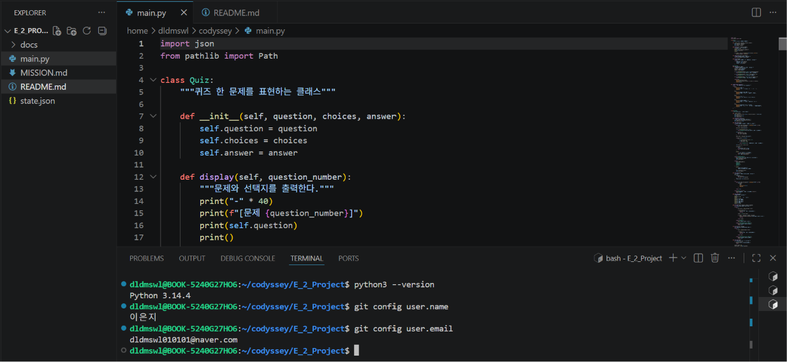
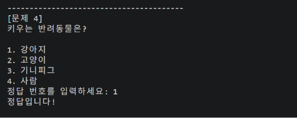
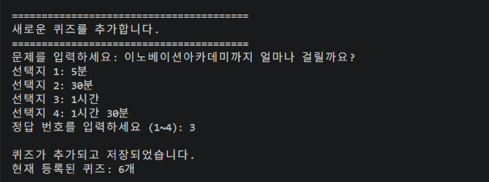
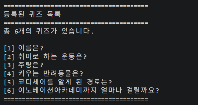
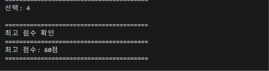
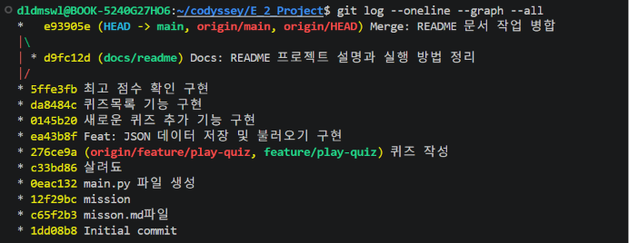
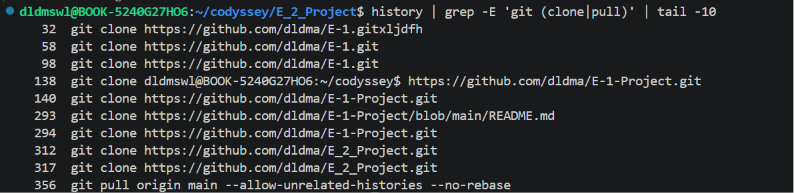

# E-2 이은지 퀴즈 게임

> 📘 **[E-2 미션 전체 내용 확인하기](./MISSION.md)**

Python 기본 문법, 클래스, JSON 파일 입출력, Git을 활용하여 만든 터미널 기반 객관식 퀴즈 게임입니다.

## 프로젝트 개요

프로그램을 실행하면 메뉴를 통해 다음 기능을 사용할 수 있습니다.

- 퀴즈 풀기
- 새로운 퀴즈 추가
- 등록된 퀴즈 목록 확인
- 최고 점수 확인
- 프로그램 종료

퀴즈와 최고 점수는 프로젝트 루트의 `state.json` 파일에 저장됩니다. 따라서 프로그램을 종료하고 다시 실행해도 사용자가 추가한 퀴즈와 최고 점수가 유지됩니다.

## 퀴즈 주제 및 선정 이유

### 퀴즈 주제

이은지 퀴즈

### 선정 이유

이노베이션 아카데미에서 앞으로 약 1년 반 동안 함께 생활하고 학습하게 되지만, 서로를 자세히 소개할 수 있는 자리는 많지 않을 것 같았습니다. 그래서 이름, 취미, 반려동물 등 나에 관한 내용을 자연스럽고 재미있게 알릴 수 있도록 ‘이은지 퀴즈’를 주제로 선정했습니다.

## 기본 퀴즈

기본적으로 이은지에 관한 퀴즈 5개가 포함되어 있습니다.

1. 이름
2. 취미로 하는 운동
3. 주량
4. 키우는 반려동물
5. 코디세이를 알게 된 경로

모든 문제는 선택지 4개 중 하나를 번호로 선택하는 객관식 4지선다 방식입니다.

## 주요 기능

### 퀴즈 풀기

- 저장된 퀴즈를 순서대로 출제합니다.
- 사용자가 1~4 사이의 정답 번호를 입력합니다.
- 정답과 오답 여부를 바로 확인할 수 있습니다.
- 모든 문제를 풀면 정답 개수와 점수를 출력합니다.
- 기존 최고 점수보다 높은 점수를 받으면 최고 점수를 갱신합니다.

### 퀴즈 추가

- 새로운 문제를 입력할 수 있습니다.
- 선택지 4개를 입력할 수 있습니다.
- 정답 번호를 1~4 중에서 입력할 수 있습니다.
- 추가한 퀴즈는 `state.json` 파일에 바로 저장됩니다.

### 퀴즈 목록

- 현재 저장된 전체 퀴즈 개수를 확인할 수 있습니다.
- 저장된 퀴즈의 문제를 번호와 함께 확인할 수 있습니다.

### 점수 확인

- 현재 저장된 최고 점수를 확인할 수 있습니다.
- 퀴즈를 한 번도 풀지 않은 경우 안내 메시지를 출력합니다.

### 데이터 저장 및 불러오기

- 퀴즈와 최고 점수를 `state.json`에 저장합니다.
- 프로그램을 다시 실행하면 기존 데이터를 불러옵니다.
- `state.json`이 없으면 기본 퀴즈 5개를 사용합니다.
- `state.json`이 손상되면 기본 데이터로 복구합니다.

### 입력 및 예외 처리

- 빈 입력을 처리합니다.
- 숫자가 아닌 입력을 처리합니다.
- 허용 범위를 벗어난 숫자를 처리합니다.
- `Ctrl+C`로 입력이 중단된 경우 안전하게 종료합니다.
- `EOFError`가 발생한 경우 안전하게 종료합니다.
- 파일 읽기와 쓰기 오류를 처리합니다.

## 실행 환경

- Python 3.10 이상
- 외부 라이브러리 사용 없음
- Python 표준 라이브러리 사용
  - `json`
  - `pathlib`

## 실행 방법

프로젝트 폴더로 이동합니다.

```bash
cd ~/codyssey/E_2_Project
```

프로그램을 실행합니다.

```bash
python3 main.py
```

Windows 환경에서 `python3` 명령이 동작하지 않으면 다음 명령어를 사용할 수 있습니다.

```bash
python main.py
```

## 메뉴 구성

```text
========================================
             이은지 퀴즈
========================================
1. 퀴즈 풀기
2. 퀴즈 추가
3. 퀴즈 목록
4. 점수 확인
5. 종료
========================================
선택:
```

## 파일 구조

```text
E_2_Project/
├── docs/
│   └── screenshots/
│       ├── add_quiz.png
│       ├── clone_pull.png
│       ├── environment.png
│       ├── git_log.png
│       ├── menu.png
│       ├── play.png
│       ├── puiz_list.png
│       └── score.png
├── main.py
├── state.json
├── README.md
└── MISSION.md
```

### `main.py`

퀴즈 게임의 전체 Python 코드가 들어 있습니다.

- `Quiz` 클래스
- `QuizGame` 클래스
- 기본 퀴즈 데이터
- 메뉴 출력
- 사용자 입력 처리
- 퀴즈 풀기
- 퀴즈 추가
- 퀴즈 목록 확인
- 최고 점수 확인
- JSON 데이터 저장 및 불러오기

### `state.json`

퀴즈 데이터와 최고 점수를 저장하는 UTF-8 형식의 JSON 파일입니다.

### `README.md`

프로젝트의 기능, 실행 방법, 파일 구조 등을 설명하는 문서입니다.

### `MISSION.md`

E-2 과제의 전체 미션 내용과 요구 사항을 정리한 문서입니다.

### `docs/screenshots`

프로그램 실행 화면과 Git 작업 기록을 저장한 폴더입니다.

## 클래스 구조

### `Quiz`

퀴즈 한 문제의 정보를 관리하는 클래스입니다.

#### 속성

- `question`: 문제
- `choices`: 선택지 4개
- `answer`: 정답 번호

#### 주요 메서드

- `display()`: 문제와 선택지를 출력합니다.
- `check_answer()`: 입력한 번호가 정답인지 확인합니다.
- `to_dict()`: 객체를 JSON 저장용 딕셔너리로 변환합니다.
- `from_dict()`: 딕셔너리 데이터를 `Quiz` 객체로 변환합니다.

### `QuizGame`

퀴즈 게임 전체의 실행 흐름을 관리하는 클래스입니다.

#### 속성

- `quizzes`: 저장된 퀴즈 목록
- `best_score`: 최고 점수
- `state_file`: 데이터 파일 경로

#### 주요 메서드

- `show_menu()`: 메인 메뉴를 출력합니다.
- `get_number()`: 지정된 범위의 숫자를 입력받습니다.
- `get_text()`: 빈 값이 아닌 문자열을 입력받습니다.
- `play_quiz()`: 퀴즈를 출제하고 점수를 계산합니다.
- `add_quiz()`: 새로운 퀴즈를 추가합니다.
- `show_quiz_list()`: 저장된 퀴즈 목록을 출력합니다.
- `show_score()`: 최고 점수를 출력합니다.
- `save_state()`: 데이터를 `state.json`에 저장합니다.
- `load_state()`: 데이터를 `state.json`에서 불러옵니다.
- `run()`: 프로그램의 전체 실행 흐름을 관리합니다.

## `state.json` 데이터 구조

```json
{
  "quizzes": [
    {
      "question": "이름은?",
      "choices": [
        "이연지",
        "이라임",
        "이지은",
        "이은지"
      ],
      "answer": 4
    }
  ],
  "best_score": 60
}
```

### 필드 설명

- `quizzes`: 저장된 전체 퀴즈 목록
- `question`: 퀴즈 문제
- `choices`: 선택지 4개
- `answer`: 정답 번호
- `best_score`: 지금까지 기록한 최고 점수

## Git 작업

이 프로젝트에서는 다음 Git 명령어를 사용했습니다.

```text
git init
git add
git commit
git push
git pull
git checkout
git clone
git merge
```

기능별로 커밋을 작성하고, 별도의 브랜치에서 기능을 개발한 뒤 `main` 브랜치에 병합했습니다.

Git 작업 기록은 다음 명령어로 확인할 수 있습니다.

```bash
git log --oneline --graph --all
```

GitHub 저장소를 별도의 로컬 폴더에 `clone`한 뒤 README를 수정하여 `push`하고, 기존 프로젝트 폴더에서 `pull`로 변경 사항을 가져오는 실습도 완료했습니다.

## 실행 화면

### 개발 환경

VS Code 프로젝트 파일과 Python 및 Git 버전을 확인한 화면입니다.



### 메인 메뉴

프로그램을 실행하면 퀴즈 풀기, 퀴즈 추가, 퀴즈 목록, 점수 확인, 종료 메뉴가 출력됩니다.


### 퀴즈 풀기

저장된 퀴즈를 풀고 각 문제의 정답 여부와 최종 점수를 확인할 수 있습니다.



### 퀴즈 추가

문제, 선택지 4개, 정답 번호를 입력하여 새로운 퀴즈를 추가할 수 있습니다.



### 퀴즈 목록

기본 퀴즈와 사용자가 추가한 퀴즈를 목록으로 확인할 수 있습니다.



### 최고 점수 확인

퀴즈를 풀면서 기록한 최고 점수를 확인할 수 있습니다.



### Git 커밋 및 브랜치 기록

기능 단위로 작성한 커밋과 브랜치 생성 및 병합 기록입니다.



### Clone 및 Pull 실습

GitHub 저장소를 새로운 폴더에 복제하고 기존 프로젝트에서 변경 사항을 가져온 기록입니다.



## 진행 상태

- [x] GitHub 저장소 생성
- [x] 미션 문서 작성
- [x] README 작성
- [x] 메뉴 기능 구현
- [x] `Quiz` 클래스 구현
- [x] `QuizGame` 클래스 구현
- [x] 기본 퀴즈 5개 작성
- [x] 퀴즈 풀기 기능 구현
- [x] 퀴즈 추가 기능 구현
- [x] 퀴즈 목록 기능 구현
- [x] 최고 점수 확인 기능 구현
- [x] `state.json` 저장 및 불러오기 구현
- [x] 입력 예외 처리 구현
- [x] 파일 오류 처리 구현
- [x] 10개 이상의 커밋 작성
- [x] 브랜치 생성 및 병합
- [x] 실행 화면 캡처
- [x] 저장소 `clone` 실습
- [x] 기존 저장소에서 `pull` 실습
