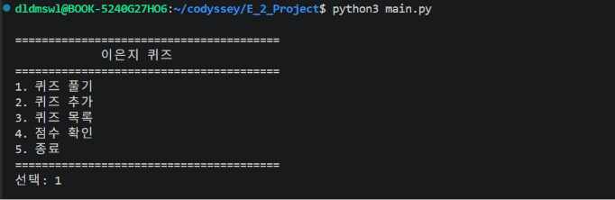

# E-2

> 📘 **[E-2 미션 전체 내용 확인하기](./MISSION.md)**

Python 기본 문법, 클래스, JSON 파일 입출력, Git을 활용하여 만드는 터미널 기반 퀴즈 게임 프로젝트입니다.

## 프로젝트 개요

프로그램을 실행하면 메뉴를 통해 퀴즈를 풀거나 새로운 퀴즈를 추가할 수 있습니다. 등록된 퀴즈 목록과 최고 점수를 확인할 수 있으며, 퀴즈와 점수 데이터는 `state.json`에 저장되어 프로그램을 다시 실행해도 유지됩니다.

## 퀴즈 주제 및 선정 이유

> **작성 예정:** 퀴즈 주제를 결정한 뒤 주제와 선정 이유를 이 부분에 작성합니다.

예시:

```text
퀴즈 주제: 영화
선정 이유: 평소 영화 감상을 좋아하며, 익숙한 주제로 퀴즈 데이터를 직접 구성하면서 Python의 클래스와 JSON 저장 방식을 학습하기 위해 선정하였다.
```

## 주요 기능

- 퀴즈 풀기
- 새로운 퀴즈 추가
- 등록된 퀴즈 목록 확인
- 최고 점수 확인 및 갱신
- JSON 파일을 이용한 데이터 저장 및 불러오기
- 잘못된 입력과 파일 오류에 대한 예외 처리
- 종료 시 데이터 안전 저장

## 실행 방법

### 실행 환경

- Python 3.10 이상
- 외부 라이브러리 사용 안 함
- Python 표준 라이브러리 사용 가능

### 프로그램 실행

프로젝트 폴더에서 다음 명령어를 실행합니다.

```bash
python3 main.py
```

Windows 환경에서 `python3` 명령이 동작하지 않으면 다음 명령어를 사용합니다.

```bash
python main.py
```

## 메뉴 구성

```text
========================================
        🎯 나만의 퀴즈 게임 🎯
========================================
1. 퀴즈 풀기
2. 퀴즈 추가
3. 퀴즈 목록
4. 점수 확인
5. 종료
========================================
선택:
```

## 파일 구조

```text
E-2/
├── README.md
├── MISSION.md
├── .gitignore
├── main.py
├── state.json
└── docs/
    └── screenshots/
        ├── menu.png
        ├── play.png
        ├── add_quiz.png
        └── score.png
```

> `main.py`, `state.json`, 실행 화면 이미지는 개발 과정에서 추가합니다.

## 클래스 구조

### `Quiz`

개별 퀴즈 한 문제를 표현합니다.

- 문제
- 선택지 4개
- 정답 번호
- 문제 출력
- 정답 확인

### `QuizGame`

퀴즈 게임 전체의 실행 흐름을 관리합니다.

- 메뉴 출력
- 퀴즈 풀기
- 퀴즈 추가
- 퀴즈 목록 확인
- 최고 점수 확인
- 데이터 저장 및 불러오기

## 데이터 파일

데이터는 프로젝트 루트의 `state.json` 파일에 UTF-8 형식으로 저장합니다.

### 역할

- 사용자가 추가한 퀴즈 저장
- 최고 점수 저장
- 프로그램 재실행 시 기존 데이터 복원

### 데이터 구조 예시

```json
{
  "quizzes": [
    {
      "question": "Python의 창시자는?",
      "choices": ["Guido", "Linus", "Bjarne", "James"],
      "answer": 1
    }
  ],
  "best_score": 3
}
```

## Git 작업 기준

- 최소 10개 이상의 의미 있는 커밋 작성
- 기능 단위로 커밋
- 별도 브랜치에서 퀴즈 풀기 기능 개발
- 작업 브랜치를 `main` 브랜치로 병합
- `init`, `add`, `commit`, `push`, `pull`, `checkout`, `clone` 사용
- 최종 작업 기록은 `git log --oneline --graph`로 확인

## 실행 화면

### 메뉴



### 퀴즈 풀기


### 퀴즈 추가


### 점수 확인


> 이미지 파일은 프로그램 구현 후 `docs/screenshots` 폴더에 추가합니다.

## 진행 상태

- [x] 프로젝트 저장소 준비
- [x] 미션 문서 작성
- [x] README 초안 작성
- [ ] 메뉴 기능 구현
- [ ] `Quiz` 클래스 구현
- [ ] 기본 퀴즈 5개 이상 작성
- [ ] 퀴즈 풀기 기능 구현
- [ ] 퀴즈 추가 기능 구현
- [ ] 퀴즈 목록 기능 구현
- [ ] 점수 기능 구현
- [ ] `state.json` 저장 및 불러오기 구현
- [ ] 예외 처리 구현
- [ ] 실행 화면 캡처
- [ ] `clone` 및 `pull` 실습
